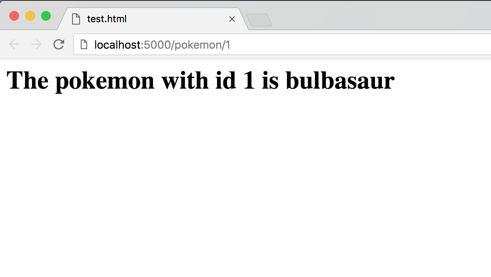
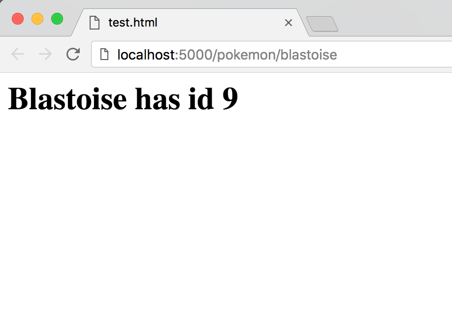

ADI Labs Technical Challenge
===================

We're excited to see that you're interested in joining ADI Labs for the Fall 2018 semester!

In Labs, we build products that are deployed and used by hundreds of students here at Columbia and beyond. To make sure you have enough technical experience to join the team, we've put together a quick technical challenge to assess your ability to use Flask, HTML/CSS, and Git/GitHub.
This challenge should take about 30 minutes to complete and requires Python 3 (a minimal amount), a basic text editor (ex. Sublime or TextEdit), Git (pre-installed on most computers), and a GitHub account. Please complete this challenge on your own.

**NOTE:** The challenge has been shortened to reduce the time needed to complete this part of the application. Specifically, the custom html home page has been removed.

----------

The Problem
-------------

ADI wants to showcase some of the awesome students here at Columbia. We want to make a webpage for each student with their name and their favorite picture. However, the ADI committee has been procrastinating by watching reruns of Pokemon episodes and their other favorite shows on Netflix.

That's where you come in; we need your help adding a page dedicated to you on our new showcase website.

Task 1
-------------
Fork this repository.

Task 2
-------------
Create a new branch from `master` and name it `dev` on your forked repo. Clone the repo (if you haven't already).

Task 3 (The important one)
-------------

On the dev branch, create a new dynamic endpoint `/pokemon/<query>`. A user queries this endpoint with a string that represents either an `id` or a `name`. Your task is: given an `id`, display the name of the pokemon with the given `id` and given a `name`, display the id of that pokemon on your webpage. According to [pokeapi](https://www.pokeapi.co/),
> Pokémon are the creatures that inhabit the world of the Pokémon games. They can be caught using Pokéballs and trained by battling with other Pokémon.

For example, if I navigate to `localhost:5000/pokemon/1`, my page will look like the following:

Similarly, if I navigate to `localhost:5000/pokemon/blastoise`, my page will look like the following:

You will find these libraries and websites helpful in completing this task:
- [Requests](http://docs.python-requests.org/en/master/)
- [PokeAPI](https://www.pokeapi.co/) -- specifically [this page](https://www.pokeapi.co/docsv2/#pokemon)

Task 4
-------------
Commit your changes and push the new branch to your forked repository. Make sure that the changes are visible on the forked branch. When you've completed these steps, copy the link of your forked repo with the changes into your application. Thanks for completing the Labs challenge!

Questions
-------------

If you have any questions about this challenge and/or Labs, reach out to us at [labs@adicu.com](mailto:labs@adicu.com).
